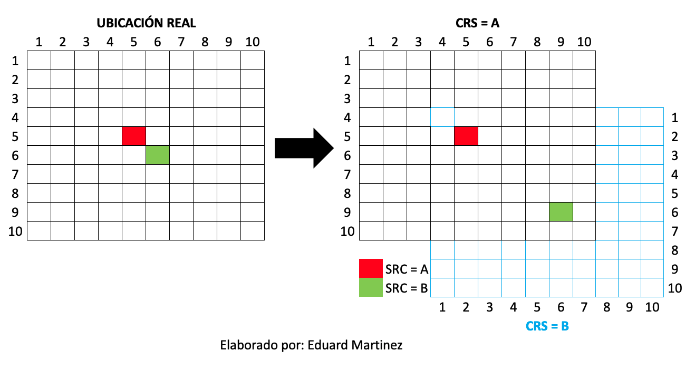
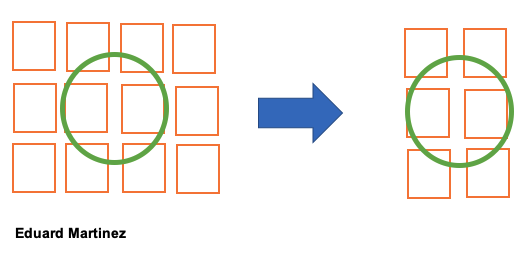
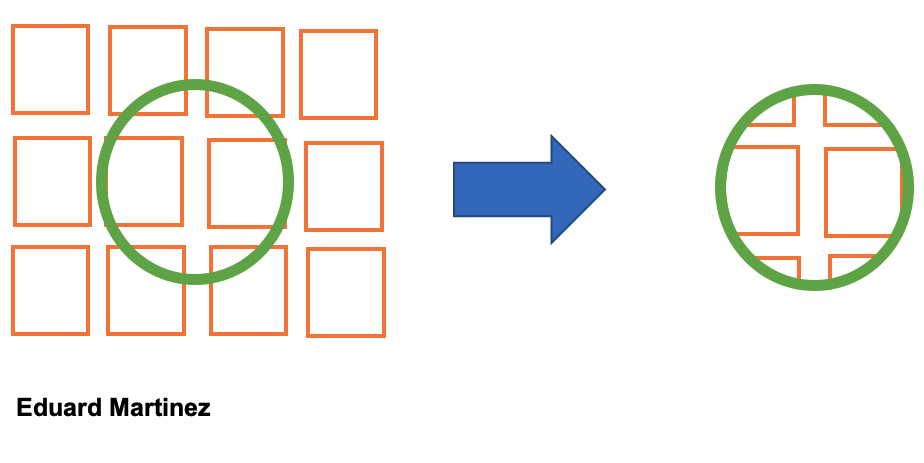
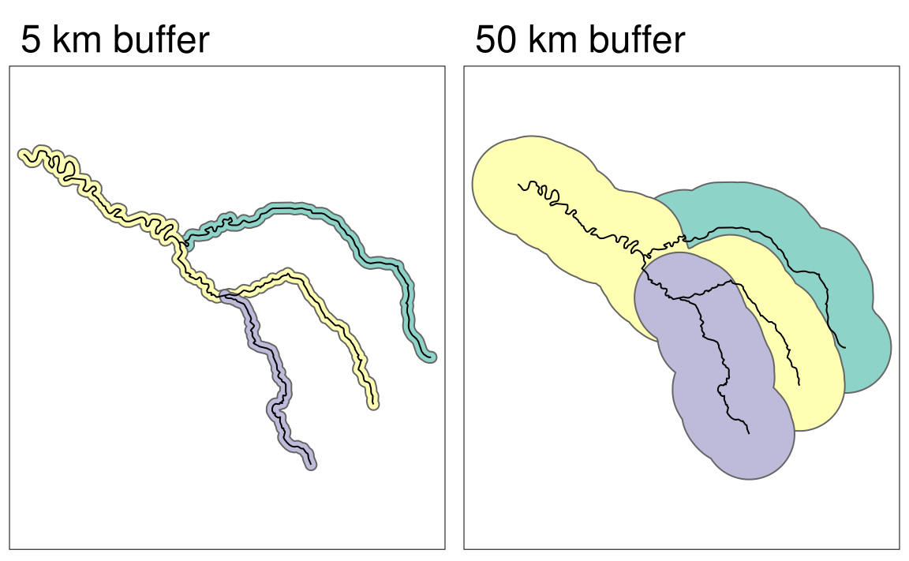
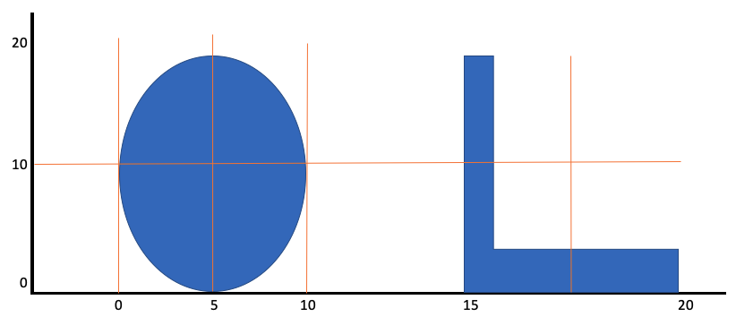

```{r setup, include=FALSE}
# load packages
library(pacman)
pacman::p_load(here,knitr,tidyverse,sf,raster,maps,ggsn,viridis,leaflet)

# option html
options(htmltools.preserve.raw = FALSE)
options(htmltools.dir.version = F)
opts_chunk$set(fig.align="center", fig.height=4 , dpi=300 , cache=F)
```

name: contenido2
# Ya vimos..

- [Introducción a datos espaciales](#gis)

- [Librería sf](#sf)

--

# Hoy veremos 

1. [Operaciones geométricas](#operation)

    1.1. Reproyectar CRS
    
    1.2. Clipping
    
    1.3. Join

    1.4. Buffer
    
    1.1. Largo y area de un objeto
    
    1.1. Distancias

    1.7. Centroides
    
2. [Aplicación en R](#apply2)

<!------------------------------->
<!--- Operaciones geométricas --->
<!------------------------------->
---
class: inverse, center, middle
name: operation
# [1. Operaciones geométricas](#contenido2)

<html><div style='float:left'></div><hr color='#FF007F' size=1px width=796px></html>

---
# 1.1. Reproyectar CRS (...)

Cuando se van a emplear dos objetos espaciales que tienen CRS diferentes, es importante que uno de los dos objetos sea reproyectado:

<div align="center">

</div>

---
#1.0. Cargemos los datos (...)

```{r,eval=T,echo=T,warning=T}
# Cargar datos
upz = st_read(here("data/input/upz.shp"))
upz %>% head()
```

---
#1.0. Veamos el mapa (...)

```{r,eval=T,echo=T,warning=T}
# Pintar objeto
mapa_plot = ggplot(data=upz ) + 
geom_sf(fill="red" , alpha=0.2 , colour="red" , size=0.5) 
mapa_plot
```

---
# 1.1. Reproyectar CRS (...)

```{r,eval=T,echo=T,warning=F}
# veamos la crs de UPZ
upz %>% crs()
upz %>% st_bbox() # Veamos los limites

# cambiar crs
upz = st_transform(upz,crs="+proj=merc +ellps=WGS84 +datum=WGS84 +units=m +no_defs")
upz %>% crs()
upz %>% st_bbox() # Veamos los limites
```

---
# 1.2. Clipping usando los atributos 

```{r,eval=T,echo=T,warning=F}
mapmuse = readRDS(here("data/input/victimas_map-muse.rds"))# Cargar datos
ggplot() + geom_sf(data = mapmuse) + theme_bw()
```

---
# 1.2. Clipping usando los atributos 

```{r,eval=T,echo=T,warning=F}
n_sder = subset(mapmuse,cod_mpio>54001 & cod_mpio<55000)
ggplot() + geom_sf(data = mapmuse) +
geom_sf(data = n_sder,col="red") + theme_bw()
```

---
# 1.2. Clipping usando la geometría (otra geometría)

```{r,eval=T,echo=T,warning=F,message=F}
depto = readRDS(here("data/input/dp deptos (2017).rds")) %>%
        subset(name_dpto=="NORTE DE SANTANDER")
ggplot() + geom_sf(data = mapmuse[depto,],col="red") +
geom_sf(data = depto,fill=NA,col="blue") + theme_bw()
```

---
# 1.2. Clipping usando la geometría (crop)

```{r,eval=F,echo=T,warning=F}
st_crop(x=poly_orange , y = poly_green) # corta la geometría de x usando la geometria de y
```
<div align="center">

</div>

---
# 1.2. Clipping usando la geometría (crop)

```{r,eval=T,echo=T,warning=F,message=F}
new_point = st_crop(x=mapmuse , y = depto)
ggplot() + geom_sf(data = new_point,col="red") +
geom_sf(data = depto,fill=NA,col="blue") + theme_bw()
```

---
# 1.2. Clipping usando la geometría (intersect)

```{r,eval=F,echo=T,warning=F}
st_intersection(x=poly_orange , y = poly_green) # corta la geometría de x usando la geometria de y
```
<div align="center">

</div>

---
# 1.2. Clipping usando la geometría (intersect)

```{r,eval=T,echo=T,warning=F,message=F}
new_point_2 = st_intersection(x=mapmuse , y = depto)
ggplot() + geom_sf(data = new_point_2,col="red") +
geom_sf(data = depto,fill=NA,col="blue") + theme_bw()
```

---
# 1.3. Join

La función `st_join()` permite agregar los atributos de objeto espacial al objeto espacial que se encuentra debajo de el.

```{r,eval=T,echo=T,warning=F,message=F}
new_point %>% head()
new_point = st_join(x = new_point , y = depto)
new_point[,9:11] %>% head()
```

---
# 1.4. Buffer

```{r,eval=F,echo=T,warning=F}
st_buffer(x=lyne , dist=5) 
st_buffer(x=lyne , dist=50)
```
<div align="center">

</div>

---
# 1.1. Largo y area

```{r,eval=T,echo=T,warning=F}
st_length(x = depto) # Largo del borde del poligono

st_area(x=depto) # Area

# agregar como atributo
depto = mutate(depto,largo_borde = st_length(x = depto),
                     area_pol = st_area(x=depto))
depto %>% head()
```

---
# 1.1. Distancia

Cuando se van a calcular distancias es necesario conocer las unidades del CRS y el tipo de distancia que calcula la función.

<div align="center">

</div>

---
# 1.1. Distancia

```{r,eval=T,echo=T,warning=F}
new_point = mutate(new_point , 
                   distance_depto = st_distance(x = new_point , y = depto) %>% as.numeric())
ggplot() + geom_sf(data = new_point,aes(col=distance_depto)) +
geom_sf(data = depto,fill=NA,col="red") + theme_bw()
```

---
# 1.7. Centroide

```{r,eval=F,echo=T,warning=F}
st_centroid(x=poly_orange ,of_largest_polygon = T)
```

<div align="center">

</div>

---
# 1.7. Centroide

```{r,eval=T,echo=T,warning=F}
c_depto = st_centroid(x=depto ,of_largest_polygon = T)
ggplot() + geom_sf(data = c_depto,col="red") +
geom_sf(data = depto,fill=NA,col="blue") + theme_bw()
```

<!----------------------->
<!--- Aplicación en R --->
<!----------------------->
---
class: inverse, center, middle
name: apply2
# [7. Aplicación en R](#contenido2)

<html><div style='float:left'></div><hr color='#FF007F' size=1px width=796px></html>

---
# De nuevo, vamos a Rstudio a replicar lo que hemos visto...

<div align="center">

</div>

<!--------------------->
<!---    Hoy vimos  --->
<!--------------------->
---
class: inverse, center, middle
name: view

# [Hoy vimos...](#contenido1)
<html><div style='float:left'></div><hr color='#FF007F' size=1px width=796px></html>

---
#  Hoy vimos...

- ☑ [Operaciones geométricas](#operation)
